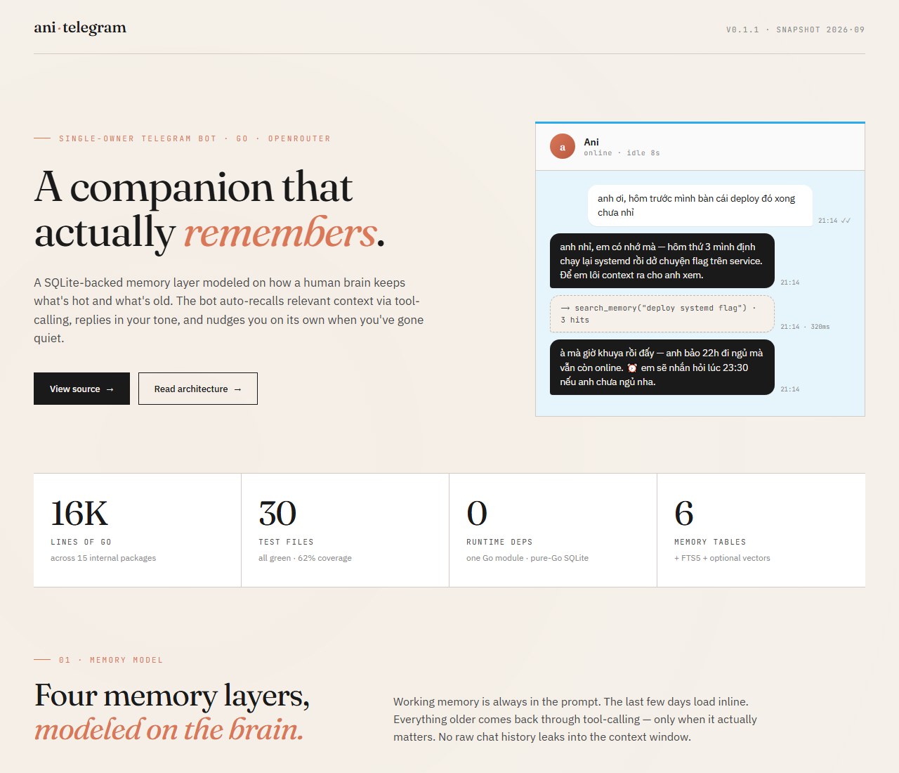

# ani-telegram

> ⚠️ **This project is no longer actively maintained.** Published as a snapshot
> of working code (last release: 2026-09-14). Issues and pull requests may not
> be reviewed. The codebase is provided for educational reference — feel free
> to fork, but expect to maintain your own fork.

Bot Telegram cho Ani. Golang, model trả lời qua OpenRouter (đổi model lúc bot đang chạy bằng lệnh
Telegram `/model`, không cần khởi động lại). System prompt là **persona riêng**
(`internal/persona/ani.txt`, nhúng vào binary). Trí nhớ sống nằm trong **SQLite**
(`internal/memdb`): chỉ trạng thái đang sống + nhật ký gần + vài quan sát nền tảng/gần đây được
nạp mỗi lượt; chủ đề dài, ngày cũ, quan sát cũ và skill đi qua tool-calling (model tự gọi khi cần).

<p align="center">
  
</p>

## Cấu trúc
```
ani-telegram/
├── cmd/
│   └── ani-telegram/main.go    # entry point mỏng — gọi app.Main()
├── internal/
│   ├── app/                    # orchestration: flag/env, worker pool, main loop
│   │   ├── app.go              # Main(), chatJob, command dispatch
│   │   ├── proactive.go        # bộ lịch "Ani tự nhắn trước": kế hoạch nhiều mốc + /proactive
│   │   ├── memoryupdate.go     # historyStore (RAM), journal memory nền, replyWithSkills (tool-calling)
│   │   ├── access.go           # bộ lọc uỷ quyền duy nhất cho update Telegram
│   │   ├── runtime_helpers.go  # botStatus, /status, debug HTTP endpoint (loopback)
│   │   ├── logging.go, fatal.go# log operational metadata đã redact secret
│   │   └── delivery*.go, embedding_indexer.go, commands.go, ...
│   ├── config/                 # nạp .env / biến môi trường
│   ├── limits/                 # giới hạn byte/số lượng cho I/O + tool-calling
│   ├── safeio/                 # đọc HTTP response có giới hạn cứng
│   ├── safelog/                # redact secret (bot token, API key) khỏi mọi log
│   ├── telegram/               # client Telegram Bot API
│   ├── openrouter/             # client OpenRouter Chat Completions (Chat/ChatJSON/ChatWithTools)
│   ├── persona/                # persona ani.txt (embed) + lắp prompt ổn định rồi state từ DB
│   ├── memdb/                  # lớp lưu trữ SQLite — bảng thật (xem "Schema" bên dưới)
│   ├── memcore/                # UPDATE/INSERT trạng thái sống + parser migrate
│   ├── memsearch/              # hybrid FTS5 + embedding retrieval
│   ├── memtopic/               # ghi chú chủ đề + tool recall_topic
│   ├── memobs/                 # tool recall_observations
│   ├── memdiary/               # tool recall_memory — nhớ lại 1 ngày nhật ký
│   └── skills/                 # tool load_skill
├── configs/
│   └── .env.example            # template — copy thành .env ở thư mục gốc
├── scripts/
│   ├── build.sh                # cross-compile sang deploy/ani-telegram
│   ├── restart.sh              # systemd restart helper (chạy trên VPS)
│   └── status.sh               # status helper (chạy trên VPS)
├── deploy/
│   ├── DEPLOY.md               # hướng dẫn deploy Ubuntu 24.04
│   ├── BETA.md                 # beta build notes
│   └── ani-telegram.service    # systemd unit template
├── docs/
│   └── ARCHITECTURE.md         # data flow + memory model
├── .env.example / .gitignore
├── go.mod / go.sum
├── LICENSE                     # MIT
├── CHANGELOG.md
└── CONTRIBUTING.md
```

Package chi tiết + data flow xem [docs/ARCHITECTURE.md](docs/ARCHITECTURE.md).

## Schema — bảng thật thay vì 1 blob key-value

| Bảng | Chứa gì |
|---|---|
| `core_state` (1 row) | `last_message_note, sleep_note, emotional_state, mang1, mang2, mang3` — mỗi field 1 cột |
| `diary_entries` | Mỗi bullet "Dấu ấn cảm xúc" = 1 row (`entry_date, text, topic`) |
| `observations` | Mỗi quan sát văn phong/sở thích = 1 row (`kind, text, observed_at`) |
| `topic_notes` | Ghi chú tự động MỚI vào 1 chủ đề = 1 row (`topic, text, noted_at`) |
| `memory_files` | Văn xuôi tĩnh: `core/memory` (template có `{{PLACEHOLDER}}`), `topic/*` (nội dung viết tay), `skills/*` |
| `settings` | Cấu hình nhỏ đổi lúc chạy: `current_model`, `current_provider`, `proactive_plan`... |
| `memory_search` | FTS5 index — được rebuild khi khởi động và đồng bộ qua trigger; model gọi `search_memory(query)` để tìm đoạn ký ức liên quan |

Persona + quy tắc cư xử nằm trong `internal/persona/ani.txt` (ổn định, đứng đầu prompt để cache
prefix). `topic/*` giữ nguyên blob viết tay; ghi chú mới vào `topic_notes`. Prompt chat chỉ liệt kê
tên chủ đề — nội dung đầy đủ qua tool `recall_topic(name)`.

## Bộ nhớ mô phỏng theo cách não người hoạt động

| Loại | Analogy não người | Hành vi |
|---|---|---|
| `core_state` (trạng thái hiện tại, mang1-3, cảm xúc) | Working memory | Luôn nạp đầy đủ mỗi lượt |
| `diary_entries` — 2 ngày gần, tối đa 20 sự kiện mới nhất/ngày | Ký ức gần đây, còn sống động | Nạp inline; phần sớm hơn của ngày dày qua `recall_memory` |
| `diary_entries` — ngày cũ hơn | Ký ức dài hạn | Tool `recall_memory(date)` |
| `observations` — 5 nền tảng + 8 gần nhất mỗi loại | Thói quen / sở thích còn nóng | Nạp inline; phần giữa qua `recall_observations` |
| `topic/*` + `topic_notes` | Trí nhớ dài hạn theo chủ đề | Chỉ mục lục; đủ nội dung qua `recall_topic(name)` |
| `skills/*` | Kiến thức thủ tục | Chỉ mục lục; đủ nội dung qua `load_skill(name)` |
| `memory_search` | Gợi nhớ theo từ khóa khi không rõ ngày/chủ đề | Tool `search_memory(query)` trả tối đa 8 đoạn liên quan có kèm nguồn |

**Lịch sử hội thoại trong lượt chat hiện tại** chỉ giữ trong RAM (`historyStore`, tối đa 20 lượt
gần nhất), **mất khi bot restart** — đây là đánh đổi có chủ đích để đổi lấy auto-recall thật qua
tool-calling, thay vì giữ nguyên toàn bộ raw history mãi mãi. Những gì đáng nhớ lâu dài đã được tự
động trích xuất vào SQLite (diary/observations/core_state) trước khi history RAM bị mất.

**Tự `/new` sau 30 phút im lặng**: `idleSessionWorker` quét mỗi phút, chat nào không có tin chat
thật nào (không tính lệnh) trong 30 phút liên tiếp thì tự xoá history RAM + nạp lại persona/memory
mới nhất — âm thầm, không gửi tin báo cho anh (khác `/new` gõ tay). Chỉ tính tin chat thường, không
tính lệnh (`/status`...) hay tin chủ động của chính Ani.

## Chạy thử

```powershell
Copy-Item configs/.env.example .env
# edit .env: ANI_TELEGRAM_BOT_TOKEN, OPENROUTER_API_KEY, ANI_ALLOWED_CHAT_ID

go test ./...
go run ./cmd/ani-telegram -log
```

Build binary cho Ubuntu 24.04 (Linux amd64, static):

```bash
./scripts/build.sh       # → deploy/ani-telegram
```

Biến bắt buộc trong `.env`: `ANI_TELEGRAM_BOT_TOKEN`, `OPENROUTER_API_KEY`, `ANI_ALLOWED_CHAT_ID`.
`ANI_MEMORY_DB` mặc định `./memory.db` (nguồn thật của bộ nhớ); `ANI_MEMORY_DIR` mặc định
`./memory` (chỉ dùng để seed 1 lần khi `memory.db` còn trống); `ANI_PERSONA_PATH` rỗng thì dùng
persona được embed trong binary. `OPENROUTER_EMBEDDING_MODEL` là **tuỳ chọn**: để rỗng thì bot
chỉ dùng FTS5 cục bộ; điền tên model embedding OpenRouter thì bot index các memory đã commit ở
nền và `search_memory` dùng hybrid semantic + FTS5.

Thêm cờ `-logdb` để in riêng mỗi lần đọc/ghi memory DB (key/bảng nào, đọc/ghi gì, bao nhiêu byte,
gọi từ đâu trong code), độc lập với `-log`. Có thể dùng cùng lúc: `go run ./cmd/ani-telegram -log -logdb`.

**Ghi nhớ tự động**: sau MỖI tin nhắn thường, bot ghi một journal SQLite nhỏ (history snapshot
bounded + ngữ cảnh trích xuất) **trước** khi gửi reply. Job được giữ ở `delivery_pending=1`,
chưa chứa draft assistant; worker FIFO chờ tới khi gửi kết thúc. Mỗi ACK cập nhật prefix đã nhận;
finalize mở gate rồi worker nền gọi thêm OpenRouter
(`ChatJSON`) với `persona.BuildExtractionPrompt` (persona + core_state + nhật ký gần, không kèm
topic/skills/observations), lưu chính xác JSON hợp lệ rồi apply `core_state` / `diary_entries` /
`observations` / topic note trong một transaction. Reply không phải chờ lượt trích xuất; restart
tự tiếp tục các job còn xử lý được theo thứ tự. Sau khi apply thành công, row journal — gồm payload chat tạm và
JSON trích xuất — bị xoá cùng transaction. Nếu JSON đúng cú pháp nhưng thiếu field memory bắt buộc,
worker thử trích xuất thêm một lần. Nếu vẫn lỗi, job tạm bị xoá ngay — không ghi `blocked`, không
giữ payload/JSON lỗi; lượt chat đó có thể không được commit vào memory nhưng các job sau vẫn tiếp tục.

Khi có `OPENROUTER_EMBEDDING_MODEL`, indexer chỉ gửi các đoạn memory **đã commit** để tạo vector;
không bao giờ gửi payload/JSON journal tạm. Nếu cấu hình embedding, API, hay vector durable không
sẵn sàng, `search_memory` trả nguyên kết quả FTS5 thay vì làm hỏng recall. `/status` chỉ hiển thị
counter/age của memory journal và semantic index (không hiển thị chat, JSON, text nguồn hay vector).

Cũng chính lượt trích xuất này trả về `proactive_after_minutes` và `proactive_appointments` — xem
"Chủ động nhắn tin" bên dưới, không tốn thêm lần gọi nào.

Gõ `/help` bất cứ lúc nào để xem lại danh sách đầy đủ các lệnh.

**Chủ động nhắn tin**: mỗi lượt chat, model tự lên nguyên một kế hoạch nhiều mốc trong lượt trích
xuất memory (`proactive.go`):

| Mốc | Field | Vai trò |
|---|---|---|
| ⏰ chờ anh rep (đúng 1 mốc, bắt buộc) | `proactive_after_minutes` | "anh im chừng này lâu thì em nhắn hỏi lại" |
| 📌 cuộc hẹn (0..n mốc) | `proactive_appointments` | việc gắn với 1 thời điểm cụ thể |

Không mốc nào đè mốc nào (cách nhau dưới 30 phút thì mốc sau bị bỏ), mỗi lượt thay toàn bộ kế
hoạch cũ (cuộc hẹn đang chờ được nhồi lại vào prompt để model chép lại cái nào còn hợp lý), kế
hoạch persist vào bảng `settings` nên sống sót qua restart/deploy. Gõ `/proactive` để xem, `off`/
`on` để tắt/bật, `clear` để dọn cuộc hẹn, `<số phút>` để ép mốc chờ rep ngay.

**Retry khi nhà cung cấp lỗi**: gặp lỗi tạm thời (quá tải, rate limit 429, lỗi 5xx, mạng chập
chờn), bot tự thử lại mỗi 60 giây tới khi thành công. Lỗi vĩnh viễn (sai API key, sai tên model...)
báo lỗi ngay.

Output rỗng hoặc `finish_reason=length` có ngân sách riêng: tối đa 3 phản hồi model cho mỗi bước
sinh (không chạy lại tool đã hoàn tất). Bot chỉ gửi bản hoàn chỉnh; hết ngân sách thì báo không
tạo được câu trả lời. `ChatJSON` dùng chung 3 lượt cho output-invalid và lỗi parse, không lồng retry.

**Gửi Telegram**: tối đa 5 attempt/đoạn trong deadline 2 phút cho cả lượt, cách các đoạn 1 giây.
429 đợi đúng `retry_after` (thiếu thì 2 giây); lỗi chắc chắn chưa gửi request dùng backoff 1/2/4/8
giây. Timeout/5xx/mất ACK là `unknown`: không tự gửi lại vì Telegram có thể đã nhận. Không gửi lại
các đoạn đã ACK; lỗi ghi ACK chỉ retry DB, không gửi lại HTTP. Lỗi vĩnh viễn dừng ngay.

History và memory chỉ có user thật cùng prefix assistant đã ACK, không có draft/rỗng. Job held
không còn owner được phục hồi lúc startup hoặc ở worker trong cùng process, không gọi lại model
hay gửi lại phần dang dở. Proactive zero-ACK bỏ journal tạm. Lượt lỗi/huỷ/unknown không ghi kế hoạch
proactive từ output lỗi vào settings. `/new` chặn callback muộn khôi phục history cũ.

`/status` giữ kết quả gần nhất: thất bại, gửi một phần, chưa xác nhận, hoặc đã gửi nhưng lưu memory
đang lỗi. Không đồng nhất lỗi DB với lỗi giao tin. Log chỉ có metadata, không chứa chat hay secret.

**Xử lý tin nhắn tuần tự qua hàng đợi**: `/status` xem bot đang rảnh/bận và còn bao nhiêu tin chờ;
`/restart` huỷ tin đang xử lý dở, không phải khởi động lại tiến trình.

`/new` xoá lịch sử hội thoại RAM của chat đó (đỡ tốn token) và nạp lại persona/memory mới nhất từ
DB. `/model <tên>` đổi model, báo luôn model mới có tool-calling/JSON mode/vision hay không.
`/providers`, `/provider <tag>|nodata|off` chọn nhà cung cấp host model hiện tại.

**Xem ảnh**: gửi thẳng ảnh (kèm chú thích hoặc không) — bot tải ảnh về file tạm (bounded, không
load hết vào RAM) rồi gửi kèm tin nhắn cho model, cần model hỗ trợ vision.

**Whitelist**: bot chỉ xử lý đúng 1 user (`ANI_ALLOWED_USER_ID`) trong đúng 1 private chat
(`ANI_ALLOWED_CHAT_ID`, bắt buộc).

## Backup

`memory.db` là nơi duy nhất giữ trí nhớ. Xem [deploy/DEPLOY.md](deploy/DEPLOY.md) cho hướng dẫn
backup định kỳ trên VPS và quy trình deploy/VPS/systemd đầy đủ.
